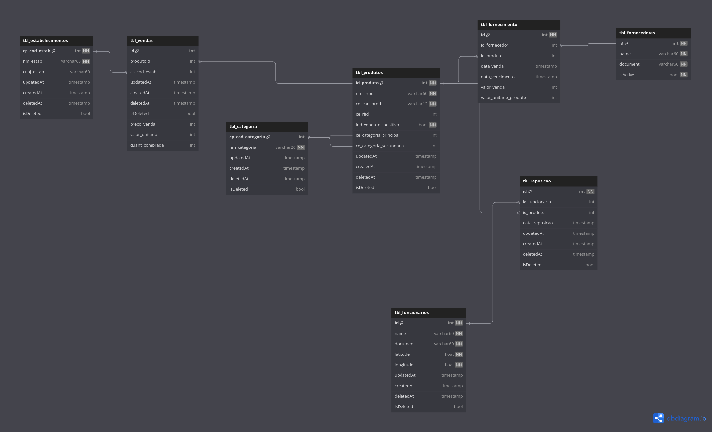

Alunos: Manoel Ribeiro e Natália Barbosa

# Complementando o projeto CompraEsperta

Após análise do problema, dos requisitos iniciais e do mini-mundo fornecidos,
sugerimos as seguintes modificações no projeto afim de melhorar o sistema e
atender melhor a necessidade dos clientes.

## Novas tabelas

### Tabela de vendas (_tbl_vendas_)

- **id** [bigint] [primary key, increment]: Identificador único de uma venda.
- **produtoId** [bigint]: Identificador do produto que foi vendido.
- **cp_cod_estab** [bigint]: Código do estabelecimento que vendeu o produto 
- **updatedAt** [timestamp]: Indicador de tempo para sempre que uma entrada sofre alteração.
- **createdAt** [timestamp, not null]: Indicador de quando a entrada foi criada.
- **deletedAt** [timestamp, default: null]: Indicador de quando o soft-delete da entrada foi realizado.
- **isDeleted** [bool, default: false]: Indicador de deleção de uma entrada (soft-delete)
- **preco_venda** [int]: Preço que da venda do produto.
- **valor_unitario** [int]: Preço unitário da venda do produto.
- **quant_comprada** [int]: Quantidade comprada do produto.

### Tabela de reposição (_tbl_reposicao_)

- **id** [bigint] [primary key, not null, increment]: Identificador único de uma reposição.
- **id_funcionario** [bigint]: Identificador do funcionário que fez uma reposição.
- **id_produto** [bigint]: Identificador do produto que foi reposto. 
- **data_reposicao** [timestamp]: Data que aconteceu a reposição.
- **updatedAt** [timestamp]: Indicador de tempo para sempre que uma entrada sofre alteração.
- **createdAt** [timestamp, not null]: Indicador de quando a entrada foi criada.
- **deletedAt** [timestamp, default: null]: Indicador de quando o soft-delete da entrada foi realizado.
- **isDeleted** [bool, default: false]: Indicador de deleção de uma entrada (soft-delete).


### Tabela de fornecimento (_tbl_fornecimento_):

- **id** [bigint] [primary key, not null, increment]: Identificador único de um fornecimento.
- **id_fornecedor** [bigint]: Identificador do fornecedor.
- **id_produto** [bigint]: Identificador do produto fornecido. 
- **data_venda** [timestamp]: Data da venda do fornecedor para o estabelecimento.
- **data_vencimento** [timestamp]: Data de vencimento dos produtos.
- **valor_venda** [int]: Valor da venda dos produtos.
- **valor_unitario_produto** [int]: Valor unitário do produto.
- **updatedAt** [timestamp]: Indicador de tempo para sempre que uma entrada sofre alteração.
- **createdAt** [timestamp, not null]: Indicador de quando a entrada foi criada.
- **deletedAt** [timestamp, default: null]: Indicador de quando o soft-delete da entrada foi realizado.
- **isDeleted** [bool, default: false]: Indicador de deleção de uma entrada (soft-delete).


## Novas variáveis

De uma forma geral, para uma boa prática de banco de dados, vamos adicionar em todas as tabelas do banco, sejam elas
novas ou antigas, os seguintes atributos:

- **isCreated**: Para saber quando aquela entrada foi criada no banco afim de auditoria.
- **isUpdated**: Para saber quando aquela entrada foi alterada no banco, afim de auditoria.
- **isDeleted**: Para fazer soft delete no banco e garantir que dados não serão pertidos.
- **deletedAt**: Para saber quando um produto foi marcado como deletado no banco de dados, afim de auditoria.

Na tabela de produtos, vamos adicionar os seguintes atributos:

- **Latitude do produto** (latitude)
- **Longitude do produto** (latitude)
- **Vencimento de produto** (data_de_vencimento)

Na tabela de fornecedores, vamos adicionar os seguintes atributos:

- **Vendedor Ativo ou não** (_is_active_)

Na tabela de funcionários, vamos adicionar os seguintes atributos:

- **Latitude de onde o funcionário trabalha** (latitude)
- **Longitude de onde o funcionário trabalhar** (latitude)

Na tabela de estabelecimentos, vamos adicionar os seguintes atributos:

- **Latitude de onde o estabelecimento fica** (latitude)
- **Longitude de onde o estabelecimento fica** (latitude)

## Novos relacionamentos

- Na tabela de fornecimento temos uma relação com fornecedor e produtos
- Na tabela de reposição temos relações com funcionários e produtos
- Na tabela de vendas temos relações com produtos

## Novos requisitos

- **RF7**: O sistema deve indicar produtos que não foram vendidos para clientes finais no último mês, assim será possível
  evitar o abastecimento de estoque desses produtos e evitar o investimento em produtos que não estão sendo vendidos.

# Criação dos modelos de banco de dados

Com uso da ferramenta [BrModelo](https://www.brmodeloweb.com/lang/pt-br/index.html), criamos o modelo conceitual do
banco de dados. Já para criação do modelo lógico a ferramenta escolhida foi o [DbDiagram](https://dbdiagram.io/home).

### Conceitual

O modelo conceitual do banco de dados, como foi disponibilizado pelo professor em sala de aula.


> Colocar aqui a imagem do modelo conceitual que o professor disponibilizou

### Lógico

Link para a visualização do modelo
lógico -> https://dbdiagram.io/d/Trilha-Pratica-Banco-de-Dados-67182e7b97a66db9a3eb4cff

Código para geração do módelo lógico no [DbDiagram](https://dbdiagram.io/home)


```
Table tbl_produtos {
  id_produto bigint [primary key, not null, increment]
  nm_prod varchar(60) [not null]
  cd_ean_prod varchar(12) [not null]
  ce_rfid bigint
  ind_venda_dispositivo bool [not null]
  ce_categoria_principal bigint [ref: > tbl_categoria.cp_cod_categoria]
  ce_categoria_secundaria bigint [ref: > tbl_categoria.cp_cod_categoria]
  latitude float8 [not null]
  longitude float8 [not null]
  updatedAt timestamp
  createdAt timestamp
  deletedAt timestamp [default: null]
  isDeleted bool [default: false]
}

Table tbl_rfid {
  cp_id_dispositivo bigint [primary key, not null]
  ind_venda_dispositivo bool [not null, default: false]
  updatedAt timestamp
  createdAt timestamp
  deletedAt timestamp [default: null]
  isDeleted bool [default: false]
}


Table tbl_vendas { //Nova tabela que não está prevista no mini-mundo
  id bigint [primary key, increment]
  produtoId bigint [ref: > tbl_produtos.id_produto] // relação muitos para muitos
  cp_cod_estab bigint [ref : > tbl_estabelecimentos.cp_cod_estab]
  updatedAt timestamp
  createdAt timestamp
  deletedAt timestamp [default: null]
  isDeleted bool [default: false]
  preco_venda int
  valor_unitario int
  quant_comprada int

}

Table tbl_categoria {
  cp_cod_categoria bigint [primary key, increment, not null]
  nm_categoria varchar(20) [not null]
  updatedAt timestamp
  createdAt timestamp
  deletedAt timestamp [default: null]
  isDeleted bool [default: false]
}

Table tbl_reposicao {//Nova tabela que não está prevista no mini-mundo
  id bigint [primary key, not null, increment]
  id_funcionario bigint [Ref: > tbl_funcionarios.id]
  id_produto bigint [Ref: > tbl_produtos.id_produto]
  data_reposicao timestamp
  updatedAt timestamp
  createdAt timestamp
  deletedAt timestamp [default: null]
  isDeleted bool [default: false]
}

Table tbl_fornecedores {
  id bigint [primary key, not null, increment]
  name varchar(60) [not null]
  document varchar(60) [not null]
  isActive bool [default: true, not null]
  latitude float8 [not null]
  longitude float8 [not null]
  updatedAt timestamp
  createdAt timestamp
  deletedAt timestamp [default: null]
  isDeleted bool [default: false]
}

Table tbl_estabelecimentos {
  cp_cod_estab bigint [primary key, not null, increment]
  nm_estab varchar(60) [not null]
  cnpj_estab varchar(60) [default: null] //talvez seja nulável por na docs diz apenas em caso de
  UF_estab varchar(2) [not null]
  cidade_estab varchar(5) [not null]
  latitude float8 [not null]
  longitude float8 [not null]
  updatedAt timestamp
  createdAt timestamp
  deletedAt timestamp [default: null]
  isDeleted bool [default: false]
}

Table tbl_fornecimento { //Nova tabela que não está prevista no mini-mundo
  id bigint [primary key, not null, increment]
  id_fornecedor bigint [Ref: > tbl_fornecedores.id]
  id_produto bigint [Ref: > tbl_produtos.id_produto]
  data_venda timestamp
  data_vencimento timestamp
  valor_venda int
  valor_unitario_produto int
  updatedAt timestamp
  createdAt timestamp
  deletedAt timestamp [default: null]
  isDeleted bool [default: false]
}


Table tbl_funcionarios {
  id bigint [primary key, not null, increment]
  name varchar(60) [not null]
  document varchar(60) [not null]
  latitude float [not null]
  longitude float [not null]
  updatedAt timestamp
  createdAt timestamp
  deletedAt timestamp [default: null]
  isDeleted bool [default: false]
}
```

# Criação do banco de Dados

Para criar nosso banco de dados vamos utilizar a ferramenta [Docker](https://www.docker.com/) e seguir as seguintes
instruções:

### 1. Verificar se o docker está instalado na sua maquina.

Abra o seu terminal e digite o comando `docker --version`, caso você tenha o docker instalado e pronto para ser usado no
seu terminal, o comando irá retornar a sua versão instalada. Caso o comando não seja reconhecido, para prosseguir você
vai precisar fazer instalação do Docker [nesse link](https://www.docker.com/) de acordo com o seu sistema operacional.

### 2. Criar uma pasta para ser usada de volume para o banco de dados.

Crie uma pasta onde preferir no seu computador para utilizar como volume do banco de dados. Isso vai ajudar para que no
futuro quando o banco estiver populado, os dados não sejam perdidos sempre que o container precisar parar e recomeçar.

### 3. Crie o container com uma imagem docker específicar para utilização do PostgreSQL.

Dentro da pasta que você criou anteriormente, rode o seguinte comando para criar o container

```
docker run --name compraesperta -p 5432:5432 --network=compraesperta -v "$PWD:/var/lib/postgresql/data" -e POSTGRES_PASSWORD=password -d postgres:alpine
```

Se o comando for bem sucedido, ele vai retornar o id alfa numérico do seu container. Para verificar os containers
rodando utilize o comando `docker ps`

### 4. Utilizando o arquivo .sql para criar o schema do banco de dados.

Primeiro, será necessario enviar os arquivos sql na pasta ./database_queries do projeto para dentro do container que
está rodando o nosso banco de dados. Para fazer isso vamos utilizar o seguinte comando:

```
docker cp trilha-pratica/database_queries compraesperta:/database_queries
```

Após rodar o comando, agora podemos executar os arquivos, primeiro vamos criar nosso schema.

```
docker exec -u postgres compraesperta psql postgres -f /database_queries/1_create_database_schema.sql
```

E em seguida popular nosso banco de dados.

```
docker exec -u postgres compraesperta psql postgres -f /database_queries/2_populate_database.sql
```

Agora temos um banco de dados criado e populado para que possamos executar algumas queries.

# Criando um plano de indexação

### Index na tabela _tbl_produtos_

Pensando em queries que fazem uma filtragem pelo nome do produto, como um usuário buscando um produto, podemos criar o seguinte index:

```
CREATE INDEX idx_produtos_nm_prod ON tbl_produtos ("nm_prod");
```

### Index na tabela _tbl_vendas_

Tentando melhorar o desempenho de joins and filtros utilizando o id do produto e o código do estabelecimento:

```
CREATE INDEX idx_vendas_produto_estab ON tbl_vendas ("produtoId", "cp_cod_estab");
```

### Index na tabela _tbl_categoria_

Pensando em queries que fazem uma filtragem pelo nome da categoria, como um usuário buscando uma categoria pelo seu nome, podemos criar o seguinte index:

```
CREATE INDEX idx_categoria_nm_categoria ON tbl_categoria ("nm_categoria");
```

### Index na tabela _tbl_reposicao_

Buscando uma melhoria em queries que envolvem filtragem de reposições por funcionário:

```
CREATE INDEX idx_reposicao_id_funcionario ON tbl_reposicao ("id_funcionario");
```

### Index na tabela _tbl_fornecedores_

Buscando uma melhoria em queries que envolvem filtragem pelo documento do fornecedor:

```
CREATE INDEX idx_fornecedores_document ON tbl_fornecedores ("document");
```

### Index na tabela _tbl_estabelecimentos_

Buscando uma melhoria em queries que envolvem filtragem pela localização:

```
CREATE INDEX idx_estabelecimentos_uf_cidade ON tbl_estabelecimentos ("UF_estab", "cidade_estab");
```

### Index na tabela _tbl_fornecimento_

Buscando uma melhoria em queries que relacionam produtos fornecidos por alguns fornecedores:

```
CREATE INDEX idx_fornecimento_id_produto ON tbl_fornecimento ("id_produto");
```

### Index na tabela _tbl_funcionarios_

Buscando uma melhoria em queries que filtram os funcionários pelos seus documentos:

```
CREATE INDEX idx_funcionarios_document ON tbl_funcionarios ("document");
```

# Executando queries no banco de dados _compra_esperta_

### Listar todas as categorias de produtos disponíveis para serem utilizadas: (_CCB_)

```
select * from tbl_categoria where "isDeleted" = false;
```

- Tempo para executar 50 vezes: 00:00:00.003411 (3.411 milliseconds)
- Tempo para executar 50 vezes com indexação: 00:00:00.00127 (0.127)

### Selecionar uma categoria específica através do seu _cp_cod_categoria_: (_CCB_)

```
select * from tbl_categoria where cp_cod_categoria = 2;
```

- Tempo para executar 50 vezes: 00:00:00.00079 (0.079 milliseconds)
- Tempo para executar 50 vezes com indexação: 00:00:00.000824 (0.824 milliseconds)

### Contar a quantidade de categorias disponíveis para utilização: (_CCB_)

```
select count(*) from tbl_categoria where "isDeleted" = false;
```

- Tempo para executar 50 vezes: 00:00:00.000469 (0.469 milliseconds)
- Tempo para executar 50 vezes com indexação: 00:00:00.000961 (0.961 )

### Listar todos os produtos que tem uma categoria ativa como categoria principal: (_CCI_)

```
select *
from tbl_produtos p
where p.ce_categoria_principal IN (select c.cp_cod_categoria
                                   from tbl_categoria c
                                   where "isDeleted" = false);
```

- Tempo para executar 50 vezes: 00:00:00.011191 (11.191 milliseconds)
- Tempo para executar 50 vezes com indexação: 00:00:00.007942 (7.942 milliseconds)

### Listar todos os produtos que tem uma categoria ativa como categoria secundária: (_CCI_)

```
select *
from tbl_produtos p
where p.ce_categoria_secundaria IN (select c.cp_cod_categoria
                                   from tbl_categoria c
                                   where "isDeleted" = false);
```

- Tempo para executar 50 vezes: 00:00:00.002718 (2.718 milliseconds)
- Tempo para executar 50 vezes com indexação: 00:00:00.005744 (5.744 milliseconds)

### Listar todos os produtos, trazendo o nome do produto e as suas categorias primária e segundária. (_CCI_)

```
select p.nm_prod, cp.nm_categoria, cs.nm_categoria
from tbl_produtos p
         inner join tbl_categoria cp on p.ce_categoria_principal = cp.cp_cod_categoria
         inner join tbl_categoria cs on p.ce_categoria_secundaria = cs.cp_cod_categoria;
```

- Tempo para executar 50 vezes: 00:00:00.006505 (6.505 milliseconds)
- Tempo para executar 50 vezes com indexação: 00:00:00.009382 (9.382 milliseconds)

### Criar uma nova categoria (_CCB_)

```
insert into "tbl_categoria" ("nm_categoria", "createdAt", "updatedAt")
values ('Nome da Categoria', NOW(), NOW());
```

- Tempo para executar 50 vezes: 00:00:00.006211 (6.211 milliseconds)
- Tempo para executar 50 vezes com indexação: 00:00:00.003806 (3.806 milliseconds)

### Deletar uma categoria (_CCB_)

```
update tbl_categoria set "isDeleted" = true where cp_cod_categoria = codigo;
```

- Tempo para executar 50 vezes: 00:00:00.001568 (1.568 milliseconds)
- Tempo para executar 50 vezes com indexação: 00:00:00.002753 (2.753 milliseconds)

### Mudar o nome de uma categoria (_CCB_)

```
update tbl_categoria set "nm_categoria" = 'Categoria' where cp_cod_categoria = codigo;
```

- Tempo para executar 50 vezes: 00:00:00.000523 (0.523 milliseconds)
- Tempo para executar 50 vezes com indexação: 00:00:00.000527 ((0.527 milliseconds))

### Selecionar um produto específico pelo seu código (_CCB_)

```
select * from tbl_produtos where id_produto = id;
```

- Tempo para executar 50 vezes: 00:00:00.001549 (1.549 milliseconds)
- Tempo para executar 50 vezes com indexação: 00:00:00.000507 (0.507 milliseconds)

### Atualizar a categoria principal de um produto específico (_CCB_)

```
update tbl_produtos set "ce_categoria_principal" = codigoCategoria where id_produto = idProduto;
```

- Tempo para executar 50 vezes: 00:00:00.00498 (0.498 milliseconds)
- Tempo para executar 50 vezes com indexação: 00:00:00.004211 (4.211 milliseconds)

### Atualizar a categoria secundária de um produto específico (_CCB_)

```
update tbl_produtos set "ce_categoria_secundaria" = codigoCategoria where id_produto = idProduto;
```

- Tempo para executar 50 vezes: 00:00:00.001494 (1.494 milliseconds)
- Tempo para executar 50 vezes com indexação: 00:00:00.001735 (1.735 milliseconds)

### Recuperar todos os produtos vendidos em determinado estabelecimento: (_CCI_)

```
select p.nm_prod, v.quant_comprada, v.valor_unitario
                from tbl_vendas v
                         inner join tbl_produtos p on v."produtoId" = p.id_produto
                where v.cp_cod_estab = 1
                  and v."isDeleted" = false;
```

- Tempo para executar 50 vezes: 00:00:00.037214 (37.214 milliseconds)
- Tempo para executar 50 vezes com indexação: 00:00:00.002083 (2.083 milliseconds)

### Quais são os nomes de todos os produtos cadastrados no banco de dados? (_CCB_)

```
select nm_prod from tbl_produtos tp;
```

- Tempo para executar 50 vezes: 00:00:00.000449 (0.449 milliseconds)
- Tempo para executar 50 vezes com indexação: 00:00:00.000512 (0.512 milliseconds)

### Quais são os fornecedores ativos? (_CCB_)

```
select * from tbl_fornecedores tf where "isActive" = true
```

- Tempo para executar 50 vezes: 00:00:00.000703 (0.703 milliseconds)
- Tempo para executar 50 vezes com indexação: 00:00:00.000565 (0.565 milliseconds)

### Produtos que estão associados a fornecedores? (_CCI_)

```
select tp.nm_prod, tf2."name" from tbl_produtos tp
join tbl_fornecimento tf on tp.id_produto = tf.id_produto
join tbl_fornecedores tf2 on tf2.id  = tf.id_fornecedor;
```

- Tempo para executar 50 vezes: 00:00:00.006713 (6.713 milliseconds)
- Tempo para executar 50 vezes com indexação: 00:00:00.005839 (5.839 milliseconds)

### Nome e o CPF de todos os funcionários cadastrados: (_CCB_)

```
select  "name", "document" from tbl_funcionarios tf;
```

- Tempo para executar 50 vezes: 00:00:00.000890 (0.890 milliseconds)
- Tempo para executar 50 vezes com indexação: 00:00:00.000780 (0.780 milliseconds)

### Quantidade de estabelecimentos por Estado: (_CCB_)

```
select "UF_estab", count("UF_estab") from tbl_estabelecimentos te
group by "UF_estab"
```

- Tempo para executar 50 vezes: 00:00:00.001290 (1.290 milliseconds)
- Tempo para executar 50 vezes com indexação: 00:00:00.001457 (1.457 milliseconds)

### Nome e o CNPJ do fornecedor mais recente cadastrado: (_CCB_)

```
select "name", "document" from tbl_fornecedores tf
order by "createdAt" desc limit 1
```

- Tempo para executar 50 vezes: 00:00:00.00987 (0.987 milliseconds)
- Tempo para executar 50 vezes com indexação: 00:00:00.01097 (1.097 milliseconds)

### Quais são os produtos com maior vazão em um determinado período: (_CCI_)

```
select  count(tp.id_produto) as "quantidade", tp.nm_prod from tbl_fornecimento tf
join tbl_produtos tp on tf.id_produto = tp.id_produto
where  tf.data_venda between tf."createdAt" and now()
group by tp.id_produto
order by "quantidade" desc;
```

- Tempo para executar 50 vezes: 00:00:00.005561 (5.561 milliseconds)
- Tempo para executar 50 vezes com indexação: 00:00:00.005273 (5.273 milliseconds)

### Lista os fornecedores que estão inativos há mais de 180 dias ou que não fizeram nenhuma venda: (_CCI_)

```
SELECT
    f.id,
    f.name AS nome_fornecedor,
    max(tf.data_venda) as "ultima_data_venda'"
FROM
    tbl_fornecedores f
LEFT JOIN
    tbl_fornecimento tf on f.id = tf.id_fornecedor
group by f.id, f."name"
having max(tf.data_venda) < current_date - interval '180 day' or max(tf.data_venda) is null;
```

- Tempo para executar 50 vezes: 00:00:00.003942 (3.942 milliseconds)
- Tempo para executar 50 vezes com indexação: 00:00:00.004429 (4.429 milliseconds)

### Produtos fornecidos por mais de um fornecedor: (_CCA_)

```
SELECT
    tp.nm_prod,
    COUNT(DISTINCT tf2.id) AS num_fornecedores
FROM
    tbl_fornecimento tf
LEFT JOIN
    tbl_produtos tp ON tf.id_produto = tp.id_produto
LEFT JOIN
    tbl_fornecedores tf2 ON tf.id_fornecedor = tf2.id
GROUP BY
    tp.id_produto, tp.nm_prod
HAVING
    COUNT(DISTINCT tf2.id) > 1;
```

- Tempo para executar 50 vezes: 00:00:00.008200 (8.200 milliseconds)
- Tempo para executar 50 vezes com indexação: 00:00:00.007279 (7.279 milliseconds)

### Estoque disponível por produto (_CCA_)

```
SELECT
    tp.nm_prod AS produto,
    COUNT(tr.id) AS reposicoes_realizadas,
    SUM(tv.quant_comprada) AS total_vendido,
    (COUNT(tr.id) - SUM(tv.quant_comprada)) AS estoque_atual
FROM
    tbl_produtos tp
LEFT JOIN
    tbl_reposicao tr ON tp.id_produto = tr.id_produto
LEFT JOIN
    tbl_vendas tv ON tp.id_produto = tv."produtoId" AND tv."isDeleted" = FALSE
WHERE
    tp."isDeleted" = FALSE
GROUP BY
    tp.nm_prod
HAVING
    (COUNT(tr.id) - SUM(tv.quant_comprada)) < 10;
```

- Tempo para executar 50 vezes: 00:00:00.008200 (8.200 milliseconds)
- Tempo para executar 50 vezes com indexação: 00:00:00.007279 (7.279 milliseconds)

### Produtos fornecidos por múltiplos fornecedores (_CCA_)

```
SELECT
    tp.nm_prod AS produto,
    COUNT(DISTINCT tf.id_fornecedor) AS num_fornecedores
FROM
    tbl_fornecimento tf
JOIN
    tbl_produtos tp ON tf.id_produto = tp.id_produto
WHERE
    tf."isDeleted" = FALSE
GROUP BY
    tp.nm_prod
HAVING
    COUNT(DISTINCT tf.id_fornecedor) > 1;
```

- Tempo para executar 50 vezes: 00:00:00.0011356 (11.356 milliseconds)
- Tempo para executar 50 vezes com indexação: 00:00:00.010063 (10.063 milliseconds)

### Produtos mais vendidos por estabelecimento (_CCA_)

```
SELECT
    te.nm_estab AS estabelecimento,
    tp.nm_prod AS produto,
    SUM(tv.quant_comprada) AS total_vendas,
    SUM(tv.quant_comprada * tv.preco_venda) AS total_vendido
FROM
    tbl_vendas tv
JOIN
    tbl_estabelecimentos te ON tv.cp_cod_estab = te.cp_cod_estab
JOIN
    tbl_produtos tp ON tv."produtoId" = tp.id_produto
WHERE
    tv."isDeleted" = FALSE
GROUP BY
    te.nm_estab, tp.nm_prod
ORDER BY
    total_vendido DESC;
```

- Tempo para executar 50 vezes: 00:00:00.005198 (5.198 milliseconds)
- Tempo para executar 50 vezes com indexação: 00:00:00.006438 (6.438 milliseconds)

### Quantidade de funcionários ativos no sistema: (_CCB_)

```
select count(*) as total_funcionarios_ativos
from tbl_funcionarios
where "isDeleted" = false;
```

- Tempo para executar 50 vezes: 00:00:00.002936 (2.936 milliseconds)
- Tempo para executar 50 vezes com indexação: 00:00:00.001064 (1.064 milliseconds)

### Fornecedores que possuem mais de 3 produtos fornecidos: (_CCB_)

```
select id_fornecedor
from tbl_fornecimento
group by id_fornecedor
having count(id_produto) > 3;
```

- Tempo para executar 50 vezes: 00:00:00.002322 (2.322 milliseconds)
- Tempo para executar 50 vezes com indexação: 00:00:00.000825 (0.825 milliseconds)

### Listar os 5 últimos produtos adicionados: (_CCB_)

```
SELECT *
FROM tbl_produtos
WHERE "isDeleted" = false
ORDER BY "createdAt" DESC
LIMIT 5;
```

- Tempo para executar 50 vezes: 00:00:00.001737 (1.737 milliseconds)
- Tempo para executar 50 vezes com indexação: 00:00:00.001416 (1.416 milliseconds)

### Fornecedores disponíveis em um certo raio: (_CCB_)

```
SELECT *
FROM tbl_fornecedores
WHERE "latitude" BETWEEN 10.0 AND 20.0
  AND "longitude" BETWEEN 30.0 AND 40.0
  AND "isDeleted" = false;
```

- Tempo para executar 50 vezes: 00:00:00.005168 (5.168 milliseconds)
- Tempo para executar 50 vezes com indexação: 00:00:00.004133 (4.133 milliseconds)

### Números de estabelecimentos em um estado: (_CCB_)

```
SELECT "UF_estab", COUNT(*) AS "total_establishments"
FROM tbl_estabelecimentos
WHERE "isDeleted" = false
GROUP BY "UF_estab";
```

- Tempo para executar 50 vezes: 00:00:00.002588 (2.588 milliseconds)
- Tempo para executar 50 vezes com indexação: 00:00:00.000834 (0.834 milliseconds)

### Listar todas as reposições de um produto específico: (_CCB_)

```
SELECT *
FROM tbl_reposicao
WHERE "id_produto" = 50
  AND "isDeleted" = false;
```

- Tempo para executar 50 vezes: 00:00:00.003014 (3.014 milliseconds)
- Tempo para executar 50 vezes com indexação: 00:00:00.000388 (0.388 milliseconds)

### Listar todos os produtos vendidos em um estabelecimento específico: (_CCI_)

```
SELECT p."nm_prod", v."quant_comprada", v."preco_venda"
FROM tbl_vendas v
INNER JOIN tbl_produtos p ON v."produtoId" = p."id_produto"
WHERE v."cp_cod_estab" = 1 AND v."isDeleted" = false;
```

- Tempo para executar 50 vezes: 00:00:00.008097 (8.097 milliseconds)
- Tempo para executar 50 vezes com indexação: 00:00:00.0124 (0.124 milliseconds)

### Contar o número de produtos em cada categoria (_CCI_)

```
SELECT c."nm_categoria", COUNT(p."id_produto") AS "total_products"
FROM tbl_categoria c
LEFT JOIN tbl_produtos p ON c."cp_cod_categoria" = p."ce_categoria_principal"
WHERE c."isDeleted" = false
GROUP BY c."nm_categoria";
```

- Tempo para executar 50 vezes: 00:00:00.008779 (8.779 milliseconds)
- Tempo para executar 50 vezes com indexação: 00:00:00.012992 (12.992 milliseconds)

### Valor total de vendas para cada estabelecimento (_CCI_)

```
SELECT e."nm_estab", SUM(v."preco_venda") AS "total_sales"
FROM tbl_vendas v
INNER JOIN tbl_estabelecimentos e ON v."cp_cod_estab" = e."cp_cod_estab"
WHERE v."isDeleted" = false
GROUP BY e."nm_estab";
```

- Tempo para executar 50 vezes: 00:00:00.00688 (0.688 milliseconds)
- Tempo para executar 50 vezes com indexação: 00:00:00.007914 (7.914 milliseconds)

### Produtos que foram restocados nos últimos 30 dias: (_CCI_)

```
SELECT p."nm_prod", r."data_reposicao"
FROM tbl_reposicao r
INNER JOIN tbl_produtos p ON r."id_produto" = p."id_produto"
WHERE r."data_reposicao" >= NOW() - INTERVAL '30 days' AND r."isDeleted" = false;
```

- Tempo para executar 50 vezes: 00:00:00.00353 (0.353 milliseconds)
- Tempo para executar 50 vezes com indexação: 00:00:00.005023 (5.023 milliseconds)

### Estabelecimentos sem vendas: (_CCI_)

```
SELECT e."nm_estab"
FROM tbl_estabelecimentos e
LEFT JOIN tbl_vendas v ON e."cp_cod_estab" = v."cp_cod_estab" AND v."isDeleted" = false
WHERE v."id" IS NULL AND e."isDeleted" = false;
```

- Tempo para executar 50 vezes: 00:00:00.003216 (3.216 milliseconds)
- Tempo para executar 50 vezes com indexação: 00:00:00.002916 (2.916 milliseconds)

### Produtos vendidos com os seus fornecedores: (_CCI_)

```
SELECT p."nm_prod", f."name" AS "supplier_name"
FROM tbl_fornecimento fs
INNER JOIN tbl_produtos p ON fs."id_produto" = p."id_produto"
INNER JOIN tbl_fornecedores f ON fs."id_fornecedor" = f."id"
WHERE fs."isDeleted" = false;
```

- Tempo para executar 50 vezes: 00:00:00.010217 (10.217 milliseconds)
- Tempo para executar 50 vezes com indexação: 00:00:00.006528 (6.528 milliseconds)

### Calcular o valor médio por unidade para cada estabelecimento: (_CCI_)

```
SELECT e."nm_estab" AS "establishment_name",
       AVG(v."valor_unitario") AS "avg_price_per_unit"
FROM tbl_estabelecimentos e
JOIN tbl_vendas v ON e."cp_cod_estab" = v."cp_cod_estab"
WHERE v."isDeleted" = false
GROUP BY e."nm_estab"
ORDER BY "avg_price_per_unit" DESC;
```

- Tempo para executar 50 vezes: 00:00:00.005399 (5.399 milliseconds)
- Tempo para executar 50 vezes com indexação: 00:00:00.012903 (12.903 milliseconds)

### Número de produtos vendidos por categoria: (CCI)

```
SELECT c."nm_categoria",
       COUNT(v."produtoId") AS "total_products_sold"
FROM tbl_categoria c
LEFT JOIN tbl_produtos p ON c."cp_cod_categoria" = p."ce_categoria_principal"
LEFT JOIN tbl_vendas v ON p."id_produto" = v."produtoId"
WHERE c."isDeleted" = false
GROUP BY c."nm_categoria"
ORDER BY "total_products_sold" DESC;
```

- Tempo para executar 50 vezes: 00:00:00.009079 (9.079 milliseconds)
- Tempo para executar 50 vezes com indexação: 00:00:00.008992 (8.992 milliseconds)

### Listar fornecedores que fornecem produtos com datas de validade próximas: (_CCA_)

```
SELECT f."name" AS "supplier_name",
       p."nm_prod" AS "product_name",
       MIN(forn."data_vencimento") AS "nearest_expiration_date"
FROM tbl_fornecimento forn
JOIN tbl_fornecedores f ON forn."id_fornecedor" = f."id"
JOIN tbl_produtos p ON forn."id_produto" = p."id_produto"
WHERE forn."data_vencimento" > CURRENT_DATE
  AND forn."isDeleted" = false
GROUP BY f."name", p."nm_prod"
ORDER BY "nearest_expiration_date" ASC;
```

- Tempo para executar 50 vezes: 00:00:00.014143 (14.143 milliseconds)
- Tempo para executar 50 vezes com indexação: 00:00:00.013436 (13.436 milliseconds)

### Listar todos os produtos associados a mais de 2 fornecedores: (_CCA_)

```
SELECT p."nm_prod", COUNT(DISTINCT f."id") AS "supplier_count"
FROM tbl_fornecimento fs
INNER JOIN tbl_produtos p ON fs."id_produto" = p."id_produto"
INNER JOIN tbl_fornecedores f ON fs."id_fornecedor" = f."id"
WHERE fs."isDeleted" = false
GROUP BY p."nm_prod"
HAVING COUNT(DISTINCT f."id") > 2;
```

- Tempo para executar 50 vezes: 00:00:00.010142 (10.142 milliseconds)
- Tempo para executar 50 vezes com indexação: 00:00:00.009273 (9.273 milliseconds)

### Verificar padrões de vendas baseadas na localização e produto: (_CCA_)

```
select func."name" AS "employee_name",
       c."nm_categoria" AS "product_category",
       COUNT(r."id") AS "restocks_handled"
FROM tbl_reposicao r
JOIN tbl_funcionarios func ON r."id_funcionario" = func."id"
JOIN tbl_produtos p ON r."id_produto" = p."id_produto"
JOIN tbl_categoria c ON c."cp_cod_categoria" = p."ce_categoria_principal"
WHERE r."isDeleted" = false
GROUP BY func."name", c."nm_categoria"
ORDER BY "restocks_handled" DESC;
```

- Tempo para executar 50 vezes: 00:00:00.004139 (4.139 milliseconds)
- Tempo para executar 50 vezes com indexação: 00:00:00.009156 (9.156 milliseconds)

### Mensurar eficiência de funcionários na reposição de um produto: (CCA)

```
SELECT func."name" AS "employee_name",
       c."nm_categoria" AS "product_category",
       COUNT(r."id") AS "restocks_handled"
FROM tbl_reposicao r
JOIN tbl_funcionarios func ON r."id_funcionario" = func."id"
JOIN tbl_produtos p ON r."id_produto" = p."id_produto"
JOIN tbl_categoria c ON c."cp_cod_categoria" = p."ce_categoria_principal"
WHERE r."isDeleted" = false
GROUP BY func."name", c."nm_categoria"
ORDER BY "restocks_handled" DESC;
```

- Tempo para executar 50 vezes: 00:00:00.015796 (15.796 milliseconds)
- Tempo para executar 50 vezes com indexação: 00:00:00.00975 (0.975 milliseconds)

### Verificar o ciclo de um produto da fornecedora até a venda: (_CCA_)

```
SELECT f."name" AS "supplier_name",
       p."nm_prod" AS "product_name",
       forn."data_venda" AS "supply_date",
       v."createdAt" AS "sale_date",
       (v."createdAt" - forn."data_venda") AS "lifecycle_duration"
FROM tbl_fornecimento forn
JOIN tbl_fornecedores f ON forn."id_fornecedor" = f."id"
JOIN tbl_produtos p ON forn."id_produto" = p."id_produto"
JOIN tbl_vendas v ON v."produtoId" = p."id_produto"
WHERE forn."isDeleted" = false
  AND v."isDeleted" = false
ORDER BY "lifecycle_duration" ASC;
```

- Tempo para executar 50 vezes: 00:00:00.015578 (15.578 milliseconds)
- Tempo para executar 50 vezes com indexação: 00:00:00.00877 (0.877 milliseconds)

### Encontrar os 5 fornecedores com maior distribuição em uma região: (_CCA_)

```
SELECT f."name" AS "supplier_name",
       COUNT(DISTINCT e."cidade_estab") AS "regions_served"
FROM tbl_fornecimento forn
JOIN tbl_fornecedores f ON forn."id_fornecedor" = f."id"
JOIN tbl_produtos p ON forn."id_produto" = p."id_produto"
JOIN tbl_vendas v ON v."produtoId" = p."id_produto"
JOIN tbl_estabelecimentos e ON v."cp_cod_estab" = e."cp_cod_estab"
WHERE forn."isDeleted" = false
GROUP BY f."name"
ORDER BY "regions_served" DESC
LIMIT 5;
```

- Tempo para executar 50 vezes: 00:00:00.021459 (21.459 milliseconds)
- Tempo para executar 50 vezes com indexação: 00:00:00.012997 (12.997 milliseconds)

# Criando Views

### Status do estoque com View

```
create materialized view estoque_status as
SELECT
   tp.nm_prod AS produto,
   COUNT(tr.id) AS reposicoes_realizadas,
   SUM(tv.quant_comprada) AS total_vendido,
   (COUNT(tr.id) - SUM(tv.quant_comprada)) AS estoque_atual
FROM
   tbl_produtos tp
LEFT JOIN
   tbl_reposicao tr ON tp.id_produto = tr.id_produto
LEFT JOIN
   tbl_vendas tv ON tp.id_produto = tv."produtoId" AND tv."isDeleted" = FALSE
WHERE
   tp."isDeleted" = FALSE
GROUP BY
   tp.nm_prod
HAVING
   (COUNT(tr.id) - SUM(tv.quant_comprada)) < 10;
```

```
select  * from estoque_status es ;
```

### Produtos com vencimento próximo

```
create materialized view produtos_proximos_vendcimento as
SELECT f."name" AS "supplier_name",
       p."nm_prod" AS "product_name",
       MIN(forn."data_vencimento") AS "nearest_expiration_date"
FROM tbl_fornecimento forn
JOIN tbl_fornecedores f ON forn."id_fornecedor" = f."id"
JOIN tbl_produtos p ON forn."id_produto" = p."id_produto"
WHERE forn."data_vencimento" > CURRENT_DATE
  AND forn."isDeleted" = false
GROUP BY f."name", p."nm_prod"
ORDER BY "nearest_expiration_date" ASC;

```

```
select * from produtos_proximos_vendcimento;

```

# Stored procedures

### Historico de vendas por período

```
CREATE OR REPLACE FUNCTION historico_vendas_por_periodo(
    data_inicio DATE,
    data_fim DATE
)
RETURNS TABLE(
    loja VARCHAR,
    produto VARCHAR,
    quantidade_vendida BIGINT,
    receita_total NUMERIC
)
LANGUAGE plpgsql
AS $$
BEGIN
    RETURN QUERY
    SELECT
        te.nm_estab AS loja,
        tp.nm_prod AS produto,
        SUM(tv.quant_comprada) AS quantidade_vendida,
        SUM(tv.preco_venda * tv.quant_comprada)::numeric AS receita_total
    FROM
        tbl_vendas tv
    JOIN
        tbl_estabelecimentos te ON tv.cp_cod_estab = te.cp_cod_estab
    JOIN
        tbl_produtos tp ON tv."produtoId" = tp.id_produto
    WHERE
        tv."createdAt" BETWEEN data_inicio AND data_fim
    GROUP BY
        te.nm_estab, tp.nm_prod
    ORDER BY
        te.nm_estab, receita_total DESC;
END;
$$;
```

```
SELECT * FROM historico_vendas_por_periodo('2024-01-01', '2024-12-31');
```

### Produtos com baixa reposição

```

CREATE OR REPLACE PROCEDURE produtos_baixa_reposicao(
    IN limite_reposicao INT
)
LANGUAGE plpgsql
AS $$
BEGIN
    CREATE TEMP TABLE temp_produtos_baixa_reposicao AS
    SELECT
        tp.nm_prod AS produto,
        COUNT(tr.id) AS frequencia_reposicao
    FROM
        tbl_produtos tp
    LEFT JOIN
        tbl_reposicao tr ON tp.id_produto = tr.id_produto
    GROUP BY
        tp.nm_prod
    HAVING
        COUNT(tr.id) < limite_reposicao
    ORDER BY
        frequencia_reposicao ASC;
END;
$$;

```

```
CALL produtos_baixa_reposicao(5);
```

```
SELECT * FROM temp_produtos_baixa_reposicao;

```
