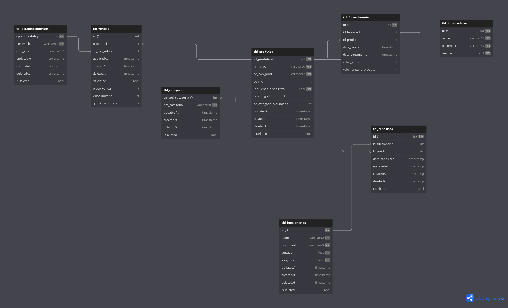

Alunos: Manoel Ribeiro e Natália Barbosa

# Complementando o projeto CompraEsperta

Após análise do problema, dos requisitos iniciais e do mini-mundo fornecidos,
sugerimos as seguintes modificações no projeto afim de melhorar o sistema e
atender melhor a necessidade dos clientes.

### Novas tabelas

> (!!!!!!!! Detalhar melhor isso para fazer entrega)

- Tabela de vendas (_tbl_vendas_): _Adicionar uma descrição_
- Tabela de reposição (_tbl_reposicao_): _Adicionar uma descrição_
- Tabela de fornecimento (_tbl_fornecimento_): _Adicionar uma descrição_

### Novas variáveis

De uma forma geral, para uma boa prática de banco de dados, vamos adicionar em todas as tabelas do banco, sejam elas
novas ou antigas, os seguintes atributos:

- **isCreated**: Para saber quando aquela entrada foi criada no banco afim de auditoria.
- **isUpdated**: Para saber quando aquela entrada foi alterada no banco, afim de auditoria.
- **isDeleted**: Para fazer soft delete no banco e garantir que dados não serão pertidos.
- **deletedAt**: Para saber quando um produto foi marcado como deletado no banco de dados, afim de auditoria.

Na tabela de produtos, vamos adicionar os seguintes atributos:

- **Latitude do produto** (latitude)
- **Longitude do produto** (latitude)
- **Vencimento de produto** (data_de_vencimento)

Na tabela de fornecedores, vamos adicionar os seguintes atributos:

- **Vendedor Ativo ou não** (_is_active_)

Na tabela de funcionários, vamos adicionar os seguintes atributos:

- **Latitude de onde o funcionário trabalha** (latitude)
- **Longitude de onde o funcionário trabalhar** (latitude)

Na tabela de estabelecimentos, vamos adicionar os seguintes atributos:

- **Latitude de onde o estabelecimento fica** (latitude)
- **Longitude de onde o estabelecimento fica** (latitude)

### Novos relacionamentos

> (!!!!!! Detalhar melhor isso para fazer entrega)

- Na tabela de fornecimento temos uma relação com fornecedor e produtos
- Na tabela de reposição temos relações com funcionários e produtos
- Na tabela de vendas temos relações com produtos

### Novos requisitos

- **RF7**: O sistema deve indicar produtos que não foram vendido para clientes finais no último mês, assim será possível evitar o abastecimento de estoque desses produtos e evitar o investimento em produtos que não estão sendo vendidos.

# Criação dos modelos de banco de dados

Com uso da ferramenta [BrModelo](https://www.brmodeloweb.com/lang/pt-br/index.html), criamos o modelo conceitual do banco de dados. Já para criação do modelo lógico a ferramenta escolhida foi o [DbDiagram](https://dbdiagram.io/home).

### Conceitual

Esse é o link público para acesso do modelo conceitual -> (atualizar o link do modelo)

> Colocar aqui a imagem do modelo conceitual que o professor disponibilizou

### Lógico

Link para a visualização do modelo lógico -> https://dbdiagram.io/d/Trilha-Pratica-Banco-de-Dados-67182e7b97a66db9a3eb4cff

Código para geração do módelo lógico no [DbDiagram](https://dbdiagram.io/home)


```
Table tbl_produtos {
  id_produto bigint [primary key, not null, increment]
  nm_prod varchar(60) [not null]
  cd_ean_prod varchar(12) [not null]
  ce_rfid bigint
  ind_venda_dispositivo bool [not null]
  ce_categoria_principal bigint [ref: > tbl_categoria.cp_cod_categoria]
  ce_categoria_secundaria bigint [ref: > tbl_categoria.cp_cod_categoria]
  latitude float8 [not null]
  longitude float8 [not null]
  updatedAt timestamp
  createdAt timestamp
  deletedAt timestamp [default: null]
  isDeleted bool [default: false]
}

Table tbl_rfid {
  cp_id_dispositivo bigint [primary key, not null]
  ind_venda_dispositivo bool [not null, default: false]
  updatedAt timestamp
  createdAt timestamp
  deletedAt timestamp [default: null]
  isDeleted bool [default: false]
}


Table tbl_vendas { //Nova tabela que não está prevista no mini-mundo
  id bigint [primary key, increment]
  produtoId bigint [ref: > tbl_produtos.id_produto] // relação muitos para muitos
  cp_cod_estab bigint [ref : > tbl_estabelecimentos.cp_cod_estab]
  updatedAt timestamp
  createdAt timestamp
  deletedAt timestamp [default: null]
  isDeleted bool [default: false]
  preco_venda int
  valor_unitario int
  quant_comprada int

}

Table tbl_categoria {
  cp_cod_categoria bigint [primary key, increment, not null]
  nm_categoria varchar(20) [not null]
  updatedAt timestamp
  createdAt timestamp
  deletedAt timestamp [default: null]
  isDeleted bool [default: false]
}

Table tbl_reposicao {//Nova tabela que não está prevista no mini-mundo
  id bigint [primary key, not null, increment]
  id_funcionario bigint [Ref: > tbl_funcionarios.id]
  id_produto bigint [Ref: > tbl_produtos.id_produto]
  data_reposicao timestamp
  updatedAt timestamp
  createdAt timestamp
  deletedAt timestamp [default: null]
  isDeleted bool [default: false]
}

Table tbl_fornecedores {
  id bigint [primary key, not null, increment]
  name varchar(60) [not null]
  document varchar(60) [not null]
  isActive bool [default: true, not null]
  latitude float8 [not null]
  longitude float8 [not null]
  updatedAt timestamp
  createdAt timestamp
  deletedAt timestamp [default: null]
  isDeleted bool [default: false]
}

Table tbl_estabelecimentos {
  cp_cod_estab bigint [primary key, not null, increment]
  nm_estab varchar(60) [not null]
  cnpj_estab varchar(60) [default: null] //talvez seja nulável por na docs diz apenas em caso de
  UF_estab varchar(2) [not null]
  cidade_estab varchar(5) [not null]
  latitude float8 [not null]
  longitude float8 [not null]
  updatedAt timestamp
  createdAt timestamp
  deletedAt timestamp [default: null]
  isDeleted bool [default: false]
}

Table tbl_fornecimento { //Nova tabela que não está prevista no mini-mundo
  id bigint [primary key, not null, increment]
  id_fornecedor bigint [Ref: > tbl_fornecedores.id]
  id_produto bigint [Ref: > tbl_produtos.id_produto]
  data_venda timestamp
  data_vencimento timestamp
  valor_venda int
  valor_unitario_produto int
  updatedAt timestamp
  createdAt timestamp
  deletedAt timestamp [default: null]
  isDeleted bool [default: false]
}


Table tbl_funcionarios {
  id bigint [primary key, not null, increment]
  name varchar(60) [not null]
  document varchar(60) [not null]
  latitude float [not null]
  longitude float [not null]
  updatedAt timestamp
  createdAt timestamp
  deletedAt timestamp [default: null]
  isDeleted bool [default: false]
}
```

# Criação do banco de Dados

Para criar nosso banco de dados vamos utilizar a ferramenta [Docker](https://www.docker.com/) e seguir as seguintes instruções:

### 1. Verificar se o docker está instalado na sua maquina.

Abra o seu terminal e digite o comando `docker --version`, caso você tenha o docker instalado e pronto para ser usado no seu terminal, o comando irá retornar a sua versão instalada. Caso o comando não seja reconhecido, para prosseguir você vai precisar fazer instalação do Docker [nesse link](https://www.docker.com/) de acordo com o seu sistema operacional.

### 2. Criar uma pasta para ser usada de volume para o banco de dados.

Crie uma pasta onde preferir no seu computador para utilizar como volume do banco de dados. Isso vai ajudar para que no futuro quando o banco estiver populado, os dados não sejam perdidos sempre que o container precisar parar e recomeçar.

### 3. Crie o container com uma imagem docker específicar para utilização do PostgreSQL.

Dentro da pasta que você criou anteriormente, rode o seguinte comando para criar o container

```
docker run --name compraesperta -p 5432:5432 --network=compraesperta -v "$PWD:/var/lib/postgresql/data" -e POSTGRES_PASSWORD=password -d postgres:alpine
```

Se o comando for bem sucedido, ele vai retornar o id alfa numérico do seu container. Para verificar os containers rodando utilize o comando `docker ps`

### 4. Utilizando o arquivo .sql para criar o schema do banco de dados.

Primeiro, será necessario enviar os arquivos sql na pasta ./database_queries do projeto para dentro do container que está rodando o nosso banco de dados. Para fazer isso vamos utilizar o seguinte comando:

```
docker cp trilha-pratica/database_queries compraesperta:/database_queries
```

Após rodar o comando, agora podemos executar os arquivos, primeiro vamos criar nosso schema.

```
docker exec -u postgres compraesperta psql postgres -f /database_queries/1_create_database_schema.sql
```

E em seguida popular nosso banco de dados.

```
docker exec -u postgres compraesperta psql postgres -f /database_queries/2_populate_database.sql
```

Agora temos um banco de dados criado e populado para que possamos executar algumas queries.

# Executando queries no banco de dados _compra_esperta_

### Em relação as categorias, podemos imaginar os seguintes problemas:

- Listar todas as categorias de produtos disponíveis para serem utilizadas: (_CCB_)

```
select * from tbl_categoria where "isDeleted" = false;
```

- Selecionar uma categoria específica através do seu _cp_cod_categoria_: (_CCB_)

```
select * from tbl_categoria where cp_cod_categoria = 2;
```

- Contar a quantidade de categorias disponíveis para utilização: (_CCB_)

```
select count(*) from tbl_categoria where "isDeleted" = false;
```

- Listar todos os produtos que tem uma categoria ativa como categoria principal: (_CCI_)

```
select *
from tbl_produtos p
where p.ce_categoria_principal IN (select c.cp_cod_categoria
                                   from tbl_categoria c
                                   where "isDeleted" = false);
```

- Listar todos os produtos que tem uma categoria ativa como categoria secundária: (_CCI_)

```
select *
from tbl_produtos p
where p.ce_categoria_secundaria IN (select c.cp_cod_categoria
                                   from tbl_categoria c
                                   where "isDeleted" = false);
```

- Listar todos os produtos, trazendo o nome do produto e as suas categorias primária e segundária. (_CCI_)

```
select p.nm_prod, cp.nm_categoria, cs.nm_categoria
from tbl_produtos p
         inner join tbl_categoria cp on p.ce_categoria_principal = cp.cp_cod_categoria
         inner join tbl_categoria cs on p.ce_categoria_secundaria = cs.cp_cod_categoria;
```

- Quais são os nomes de todos os produtos cadastrados no banco de dados?
  `select nm_prod from tbl_produtos tp;`
- Quais são os fornecedores ativos?
  `select * from tbl_fornecedores tf where "isActive" = true `

- Produtos que estão associados a fornecedores?

```
select tp.nm_prod, tf2."name" from tbl_produtos tp
join tbl_fornecimento tf on tp.id_produto = tf.id_produto
join tbl_fornecedores tf2 on tf2.id  = tf.id_fornecedor
```

- nome e o CPF de todos os funcionários cadastrados
  `select  "name", "document" from tbl_funcionarios tf `

- Quais produtos estão com estoque abaixo do mínimo em uma loja?

- Quantidade de estabelecimentos por Estado

```
select "UF_estab", count("UF_estab") from tbl_estabelecimentos te
group by "UF_estab"
```

- Nome e o CNPJ do fornecedor mais recente cadastrado

```
select "name", "document" from tbl_fornecedores tf
order by "createdAt" desc limit 1
```

- Quais são os produtos com maior vazão em um determinado período

```
select  count(tp.id_produto) as "quantidade", tp.nm_prod from tbl_fornecimento tf
join tbl_produtos tp on tf.id_produto = tp.id_produto
where  tf.data_venda between tf."createdAt" and now()
group by tp.id_produto
order by "quantidade" desc;
```

- Lista os fornecedores que estão inativos há mais de 180 dias ou que não fizeram nenhuma venda.

```
SELECT
    f.id,
    f.name AS nome_fornecedor,
    max(tf.data_venda) as "ultima_data_venda'"
FROM
    tbl_fornecedores f
LEFT JOIN
    tbl_fornecimento tf on f.id = tf.id_fornecedor
group by f.id, f."name"
having max(tf.data_venda) < current_date - interval '180 day' or max(tf.data_venda) is null;
```

- Produtos fornecidos por mais de um fornecedor.

```
SELECT
    tp.nm_prod,
    COUNT(DISTINCT tf2.id) AS num_fornecedores
FROM
    tbl_fornecimento tf
LEFT JOIN
    tbl_produtos tp ON tf.id_produto = tp.id_produto
LEFT JOIN
    tbl_fornecedores tf2 ON tf.id_fornecedor = tf2.id
GROUP BY
    tp.id_produto, tp.nm_prod
HAVING
    COUNT(DISTINCT tf2.id) > 1;
```
