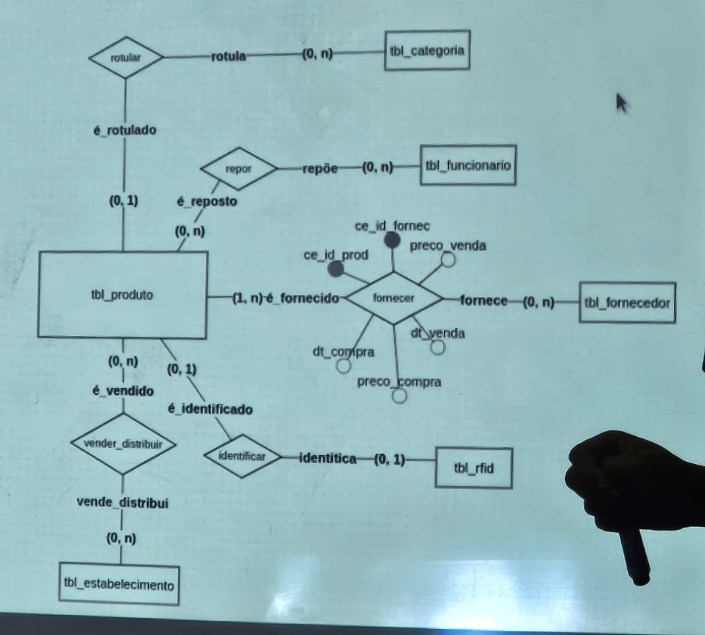

Alunos: Manoel Ribeiro e Natália Barbosa

# Complementando o projeto CompraEsperta

Após análise do problema, dos requisitos iniciais e do mini-mundo fornecidos,
sugerimos as seguintes modificações no projeto afim de melhorar o sistema e
atender melhor a necessidade dos clientes.

### Novas tabelas

- **Vendas** (_vendas_): Uma tabela para registrar as vendas feitas para usuários finais nos canais de autoatendimento.
- **Audits** (_auditorias_): Uma tabela para salvar as ações do sistema efetuadas por usuários.
- **Compras para o estoque** (_compras_de_estoque_): Tabela para registrar as ordens de compra com os fornecedores e atender o requisito RF4
- **Abastecimentos de containers** (_abastecimentos_de_container_): Tabela para registrar os abastecimentos que certo funcionário precisa executar em um container, informando qual container e também quais produtos precisam ser reabastecidos.
- **Clientes Finais** (_clientes_finais_): Tabela para guardar informações mínimas sobre os usuários que comprar no totem de auto atendimento

### Novas variáveis

De uma forma geral, para uma boa prática de banco de dados, vamos adicionar em todas as tabelas do banco, sejam elas
novas ou antigas, os seguintes atributos:

- **isCreated**: Para saber quando aquela entrada foi criada no banco afim de auditoria.
- **isUpdated**: Para saber quando aquela entrada foi alterada no banco, afim de auditoria.
- **isDeleted**: Para fazer soft delete no banco e garantir que dados não serão pertidos.
- **deletedAt**: Para saber quando um produto foi marcado como deletado no banco de dados, afim de auditoria.

Na tabela de produtos, vamos adicionar os seguintes atributos:

- **Latitude do produto** (latitude)
- **Longitude do produto** (latitude)
- **Vencimento de produto** (data_de_vencimento)

Na tabela de fornecedores, vamos adicionar os seguintes atributos:

- **Vendedor Ativo ou não** (_is_active_)

Na tabela de funcionários, vamos adicionar os seguintes atributos:

- **Latitude do produto** (latitude)
- **Longitude do produto** (latitude)

### Novos relacionamentos

- **Produtos e Compras de estoque** (_produtos_stock_purchases_): Esse relacionamento é necessário para registrar as compras de estoque com fornecedores para que o sistema possa ter um histórico de compras e atenda o RF4. Toda compra de estoque pode ter um ou mais produtos associados à ela.
- **Fornecedores e Compras de estoque** (_fornecedores_stock_purchases_): Esse relacionamento é necessário para registrar as compras de estoque com fornecedores para que o sistema possa ter um histórico de compras e atenda o RF4. Toda compra de estoque pode ter um ou mais fornecedores associados à ela.
- **Produtos e abastecimentos de containers** (_container_supplies_produtos_): Esse relacionamento é necessário para registrar quais produtos devem ser reabastecidos em determinado container quando o sistema disparar essa ação através da automação com IA. Um reabastecimento de estoque pode ter um ou vários produtos.
- **Funcionário e abastecimentos de containers** (_funcionario_supplies_produtos_): Esse relacionamento é necessário para registrar qual funcionário deve reabastecer determinado container quando o sistema disparar essa ação através da automação com IA. Cara reabastecimento de estoque deve ser executado por 1 funcionário.

### Novos requisitos

- **RF7**: Fazer auditoria dentro da sistema, para que seja possível localizar possíveis ações como
  deleção de lojas e etc
- **RF8**: Registrar as vendas para clientes finais, para gerar dados de vendas e possibilitar uma implementação futura de campanhas de desconto e promoção com base no comportamento dos usuários.
- **RF9**: O sistema deve indicar produtos que não foram vendido para clientes finais no último mês, assim será possível evitar o abastecimento de estoque desses produtos e evitar o investimento em produtos que não estão sendo vendidos.

# Criação dos modelos de banco de dados

Com uso da ferramenta [BrModelo](https://www.brmodeloweb.com/lang/pt-br/index.html), criamos o modelo conceitual do banco de dados. Já para criação do modelo lógico a ferramenta escolhida foi o [DbDiagram](https://dbdiagram.io/home).

### Conceitual

Esse é o link público para acesso do modelo conceitual -> https://app.brmodeloweb.com/#!/publicview/67183acf36c30f6ffd71938d



### Lógico

Link para a visualização do modelo lógico -> https://dbdiagram.io/d/Trilha-Pratica-Banco-de-Dados-67182e7b97a66db9a3eb4cff

Código para geração do módelo lógico no [DbDiagram](https://dbdiagram.io/home)

```
Table tbl_produtos {
  id_produto int [primary key, not null]
  nm_prod varchar60 [not null]
  cd_ean_prod varchar12 [not null]
  ce_rfid int
  ind_venda_dispositivo bool [not null]
  ce_categoria_principal int
  ce_categoria_secundaria int
  updatedAt timestamp
  createdAt timestamp
  deletedAt timestamp [default: null]
  isDeleted bool [default: false]
}

Table tbl_vendas { //Todos os produtos que estão em uma venda
  id int [primary key]
  produtoId int [ref: > tbl_produtos.id_produto] // relação muitos para muitos
  cp_cod_estab int [ref : > tbl_estabelecimentos.cp_cod_estab]
  updatedAt timestamp
  createdAt timestamp
  deletedAt timestamp [default: null]
  isDeleted bool [default: false]
  preco_venda int
  valor_unitario int
  quant_comprada int

}


Table tbl_categoria {
  cp_cod_categoria int [primary key]
  nm_categoria varchar20 [not null]
  updatedAt timestamp
  createdAt timestamp
  deletedAt timestamp [default: null]
  isDeleted bool [default: false]
}

Table tbl_reposicao{
  id int [primary key, not null]
  id_funcionario int [Ref: > tbl_funcionarios.id]
  id_produto int [Ref: > tbl_produtos.id_produto]
  data_reposicao timestamp
  updatedAt timestamp
  createdAt timestamp
  deletedAt timestamp [default: null]
  isDeleted bool [default: false]
}


Table tbl_fornecedores {
  id int [primary key, not null]
  name varchar60 [not null]
  document varchar60 [not null]
  isActive bool [default: true, not null]
}

Table tbl_estabelecimentos {
  cp_cod_estab int [primary key, not null]
  nm_estab varchar60 [not null]
  cnpj_estab varchar60 [default: null] //talvez seja nulável por na docs diz apenas em caso de
  updatedAt timestamp
  createdAt timestamp
  deletedAt timestamp [default: null]
  isDeleted bool [default: false]
}

Table tbl_fornecimento{
  id int [primary key, not null]
  id_fornecedor int [Ref: > tbl_fornecedores.id]
  id_produto int [Ref: > tbl_produtos.id_produto]
  data_venda timestamp
  data_vencimento timestamp
  valor_venda int
  valor_unitario_produto int
}


Table tbl_funcionarios {
  id int [primary key, not null]
  name varchar60 [not null]
  document varchar60 [not null]
  latitude float [not null]
  longitude float [not null]
  updatedAt timestamp
  createdAt timestamp
  deletedAt timestamp [default: null]
  isDeleted bool [default: false]
}


Ref: "tbl_produtos"."ce_categoria_principal" < "tbl_categoria"."cp_cod_categoria"

Ref: "tbl_produtos"."ce_categoria_secundaria" < "tbl_categoria"."cp_cod_categoria"


```

# push de teste
